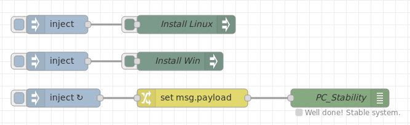

# node-red-contrib-config
A Node Red node for setting global and flow context properties at startup and during runtime.

This node allows you to store configuration information in a central location and use it to set global and flow context properties at startup (initialization phase) or during runtime. Multiple `config` nodes can be used to store alternate configuration settings and switch between them during runtime.  
  
**Fig. 1:** Node appearance

## Installation

### In Node-RED
* Via Manage Palette -> Search for "node-red-contrib-config"

### In a shell
* go to the Node-RED installation folder, e.g.: `~/.node-red`
* run `npm install node-red-contrib-config`

## Usage

### Node Configuration

  
**Fig. 2:** Node properties

#### Configuration of *Property* and *Value* ####
The object given in the **Property** field is the context property which shall be modified. This object can be a global or a flow variable.  
The contents of the **Value** field is the data which is written to the context property object. This object can be of the type
* string
* number
* boolean
* JSON
* timestamp

#### Checkbox *Active* ####
If  **Active** is checked (i.e. node is active), the configuration properties will be applied at startup before any flows are started. This may e.g. be used for initialization purposes.

### Input ###
If the node receives any `msg`, it will apply the configuration properties contained in that `config` node. I.e. the value of the *Value* field is written into the variable given in the *Property* field. The received `msg` is discarded.  
This allows e.g. to alter configurations **programmatically**.

Pressing the **button on the left side** of the node will also apply the configuration properties contained in that `config` node.  
This allows also to alter configurations **manually**.

### Output ###
The `config` node has no output data.

## Example ##
***
**Remark**: Example flows are present in the examples subdirectory. In Node-RED they can be imported via the import function and then selecting *Examples* in the vertical tab menue.
***

The example flow shows an example where the global variable *PC_Stability*
* is modified at startup (initial operation, only by the upper `config` node),
* can be modified by the left button of both `config` nodes (manual operation),
* can be modified by the upper both inject nodes (`msg` initiated operation).

The lower nodes only show the contents of the modified global variable.

[**ConfigNodeExampleFlow.json**](examples/ConfigNodeExampleFlow.json)  

**Fig. 3:** `Config` node example

The  following figure shows the node configuration of the upper `config`node.

**Fig. 4:** Example `Config` node properties
